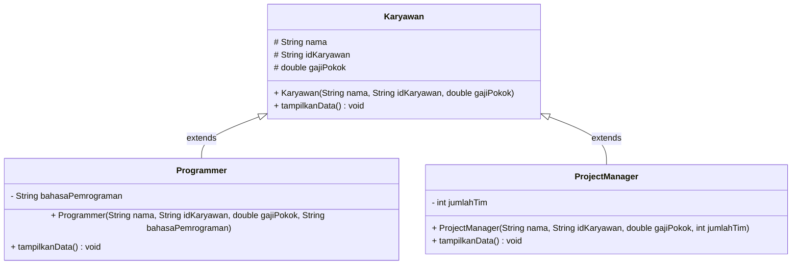
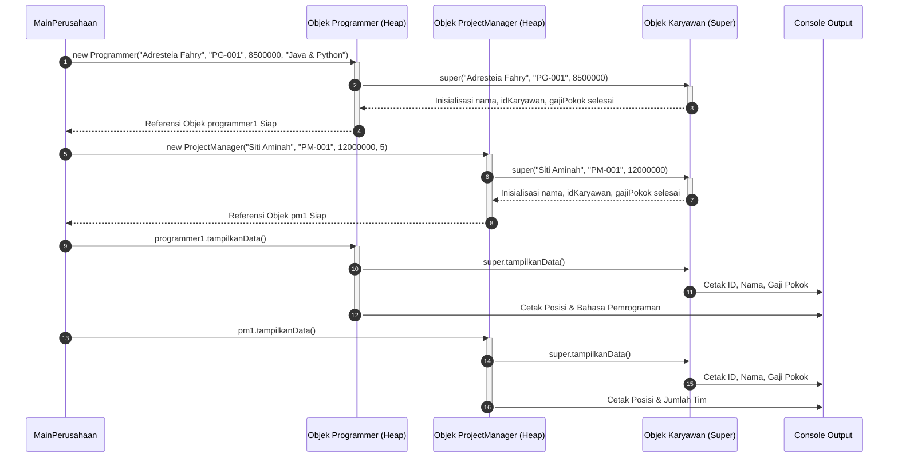

# 📘 LAPORAN PRAKTIKUM LKPD - PEMROGRAMAN BERORIENTASI OBJEK (PBO)
## PERTEMUAN 4: AKTIVITAS 3 - STUDI KASUS PROYEK MINI (EVALUASI AKHIR 5 JP)
### 🏢 SISTEM MANAJEMEN KARYAWAN SOFTWARE HOUSE

---

## 📑 DAFTAR ISI
1. [Identitas Tugas & Ketentuan Spesifikasi](#-1-identitas-tugas--ketentuan-spesifikasi)
2. [Tujuan Pembelajaran (Competencies)](#-2-tujuan-pembelajaran-competencies)
3. [Landasan Teori Pemrograman Berorientasi Objek](#-3-landasan-teori-pemrograman-berorientasi-objek)
   - [3.1 Penerapan Pewarisan (Inheritance) pada Sistem Karyawan](#31-penerapan-pewarisan-inheritance-pada-sistem-karyawan)
   - [3.2 Peran Keyword `extends`](#32-peran-keyword-extends)
   - [3.3 Rantai Inisialisasi Constructor (`super(...)`)](#33-rantai-inisialisasi-constructor-super)
   - [3.4 Method Overriding (`@Override`) pada `tampilkanData()`](#34-method-overriding-override-pada-tampilkandata)
   - [3.5 Access Modifiers & Enkapsulasi Atribut](#35-access-modifiers--enkapsulasi-atribut)
4. [Struktur Berkas & Diagram Arsitektur UML](#-4-struktur-berkas--diagram-arsitektur-uml)
   - [4.1 Pohon Direktori Proyek](#41-pohon-direktori-proyek)
   - [4.2 Diagram Kelas UML (Mermaid Class Diagram)](#42-diagram-kelas-uml-mermaid-class-diagram)
   - [4.3 Diagram Sekuensial Eksekusi Memori](#43-diagram-sekuensial-eksekusi-memori)
5. [Bedah Kode Sumber Terperinci (Line-by-Line Breakdown)](#-5-bedah-kode-sumber-terperinci-line-by-line-breakdown)
   - [5.1 `Karyawan.java` (Parent Class)](#51-karyawanjava-parent-class)
   - [5.2 `Programmer.java` (Subclass 1)](#52-programmerjava-subclass-1)
   - [5.3 `ProjectManager.java` (Subclass 2)](#53-projectmanagerjava-subclass-2)
   - [5.4 `MainPerusahaan.java` (Main Class)](#54-mainperusahaanjava-main-class)
6. [Panduan Kompilasi & Eksekusi CLI](#-6-panduan-kompilasi--eksekusi-cli)
7. [Analisis Output Eksekusi Terminal](#-7-analisis-output-eksekusi-terminal)
8. [Tabel Perbandingan & FAQ Refleksi Evaluasi](#-8-tabel-perbandingan--faq-refleksi-evaluasi)
9. [Kesimpulan & Penutup](#-9-kesimpulan--penutup)

---

## 📌 1. IDENTITAS TUGAS & KETENTUAN SPESIFIKASI

* **Mata Pelajaran / Kuliah**: Pemrograman Berorientasi Objek (PBO)
* **Topik Praktikum**: Pertemuan 4 - Evaluasi Akhir 5 JP (Pewarisan / Inheritance)
* **Judul Tugas**: **Aktivitas 3: Studi Kasus Proyek Mini - Sistem Manajemen Karyawan Software House**

### 📋 Ketentuan Spesifikasi Tugas:
1. **Parent Class (`Karyawan`)**:
   - Memiliki atribut `nama`, `idKaryawan`, dan `gajiPokok`.
   - Memiliki method `tampilkanData()`.
2. **Subclass 1 (`Programmer`)**:
   - Mewarisi kelas `Karyawan`.
   - Memiliki tambahan atribut `bahasaPemrograman`.
   - Melakukan **Method Overriding** pada `tampilkanData()`.
3. **Subclass 2 (`ProjectManager`)**:
   - Mewarisi kelas `Karyawan`.
   - Memiliki tambahan atribut `jumlahTim`.
   - Melakukan **Method Overriding** pada `tampilkanData()`.
4. **Main Class (`MainPerusahaan`)**:
   - Menguji instansiasi objek dari kedua subclass (`Programmer` dan `ProjectManager`) minimal masing-masing 1 objek.

---

## 🎯 2. TUJUAN PEMBELAJARAN (COMPETENCIES)
Setelah menyelesaikan Studi Kasus Proyek Mini ini, peserta didik diharapkan mampu:
1. Memodelkan entitas dunia nyata (*Software House*) ke dalam struktur hirarki **Inheritance** PBO.
2. Menggunakan keyword **`extends`** untuk menghubungkan `Programmer` dan `ProjectManager` ke kelas induk `Karyawan`.
3. Memahami pembuatan dan pemanggilan **Constructor** superclass menggunakan **`super(nama, idKaryawan, gajiPokok)`**.
4. Memahami dan menerapkan **Method Overriding (`@Override`)** pada method `tampilkanData()`.
5. Menerapkan enkapsulasi variabel (`protected` vs `private`) pada arsitektur kelas.

---

## 📚 3. LANDASAN TEORI PEMROGRAMAN BERORIENTASI OBJEK

### 3.1 Penerapan Pewarisan (Inheritance) pada Sistem Karyawan
Dalam sebuah *Software House*, setiap entitas pekerja (baik Programmer maupun Project Manager) adalah seorang **Karyawan**. 

Tanpa pewarisan, variabel `nama`, `idKaryawan`, dan `gajiPokok` harus ditulis berulang kali di kelas `Programmer` dan `ProjectManager`. Dengan **Inheritance**:
- Atribut dasar (`nama`, `idKaryawan`, `gajiPokok`) didefinisikan satu kali di kelas induk **`Karyawan`**.
- Subclass cukup menambahkan atribut spesifik per peran (`bahasaPemrograman` untuk Programmer, `jumlahTim` untuk Project Manager).

---

### 3.2 Peran Keyword `extends`
Keyword **`extends`** digunakan oleh kelas anak untuk mewarisi atribut dan method dari kelas induk.

```java
public class Programmer extends Karyawan { ... }
public class ProjectManager extends Karyawan { ... }
```

---

### 3.3 Rantai Inisialisasi Constructor (`super(...)`)
Constructor induk **tidak diwarisi** secara otomatis. Oleh karena itu, constructor pada subclass **WAJIB** memanggil constructor superclass menggunakan perintah **`super(...)`** pada baris pertama eksekusinya.

```java
public Programmer(String nama, String idKaryawan, double gajiPokok, String bahasaPemrograman) {
    super(nama, idKaryawan, gajiPokok); // Mengirimkan data dasar ke constructor Karyawan
    this.bahasaPemrograman = bahasaPemrograman;
}
```

---

### 3.4 Method Overriding (`@Override`) pada `tampilkanData()`
Method Overriding terjadi ketika subclass menuliskan kembali method `tampilkanData()` dengan nama, parameter, dan tipe kembalian yang persis sama seperti pada `Karyawan`.

Dengan memanggil **`super.tampilkanData();`** di dalam method subclass, subclass mencetak data umum terlebih dahulu, lalu mencetak data spesifik perannya.

---

### 3.5 Access Modifiers & Enkapsulasi Atribut
- **`protected`**: Atribut `nama`, `idKaryawan`, `gajiPokok` pada kelas `Karyawan` diberi modifier `protected` agar dapat diakses langsung oleh subclass `Programmer` dan `ProjectManager`.
- **`private`**: Atribut `bahasaPemrograman` pada `Programmer` dan `jumlahTim` pada `ProjectManager` dibatasi dengan `private` demi menerapkan prinsip enkapsulasi data hiding.

---

## 🏗️ 4. STRUKTUR BERKAS & DIAGRAM ARSITEKTUR UML

### 4.1 Pohon Direktori Proyek
```text
pertemuan-4/
├── README.md                               <- Laporan LKPD Utama Aktivitas 3 (Dokumen Ini)
├── bin/                                    <- Output Hasil Kompilasi Bytecode (.class)
│   └── Pewarisan/
│       ├── Karyawan.class
│       ├── Programmer.class
│       ├── ProjectManager.class
│       └── MainPerusahaan.class
└── src/                                    <- Kode Sumber Java (.java)
    └── Pewarisan/
        ├── Karyawan.java                   <- Parent Class (Superclass)
        ├── Programmer.java                 <- Subclass 1 (Programmer)
        ├── ProjectManager.java             <- Subclass 2 (Project Manager)
        ├── MainPerusahaan.java             <- Main Class (Executable Entry Point)
        └── README.md                       <- Ringkasan Sub-paket Pewarisan
```

---

### 4.2 Diagram Kelas UML (Mermaid Class Diagram)



---

### 4.3 Diagram Sekuensial Eksekusi Memori



---

## 💻 5. BEDAH KODE SUMBER TERPERINCI (LINE-BY-LINE BREAKDOWN)

### 5.1 `Karyawan.java` (Parent Class)
**Lokasi Berkas**: [src/Pewarisan/Karyawan.java](file:///e:/Mimin%20Adresteia/pertemuan-4/src/Pewarisan/Karyawan.java)

```java
1: package Pewarisan;
2: 
3: // Parent Class (Superclass)
4: public class Karyawan {
5:     protected String nama;
6:     protected String idKaryawan;
7:     protected double gajiPokok;
8: 
9:     // Constructor Parent Class
10:    public Karyawan(String nama, String idKaryawan, double gajiPokok) {
11:        this.nama = nama;
12:        this.idKaryawan = idKaryawan;
13:        this.gajiPokok = gajiPokok;
14:    }
15: 
16:    // Method dasar yang akan di-override oleh subclass
17:    public void tampilkanData() {
18:        System.out.println("ID Karyawan : " + idKaryawan);
19:        System.out.println("Nama        : " + nama);
20:        System.out.println("Gaji Pokok  : Rp " + String.format("%,.0f", gajiPokok));
21:    }
22: }
```

#### 🔍 Penjelasan Baris Demi Baris `Karyawan.java`:
- **Baris 5–7**: Deklarasi atribut `nama`, `idKaryawan`, dan `gajiPokok` bertipe `protected` agar bisa diakses langsung oleh subclass `Programmer` dan `ProjectManager`.
- **Baris 10–14**: Constructor kelas induk untuk menginisialisasi atribut `nama`, `idKaryawan`, dan `gajiPokok`.
- **Baris 17–21**: Method `tampilkanData()` yang bertugas mencetak informasi dasar setiap karyawan dengan format mata uang yang rapi.

---

### 5.2 `Programmer.java` (Subclass 1)
**Lokasi Berkas**: [src/Pewarisan/Programmer.java](file:///e:/Mimin%20Adresteia/pertemuan-4/src/Pewarisan/Programmer.java)

```java
1: package Pewarisan;
2: 
3: // Subclass 1: Programmer (mewarisi Karyawan)
4: public class Programmer extends Karyawan {
5:     private String bahasaPemrograman;
6: 
7:     // Constructor Subclass Programmer
8:     public Programmer(String nama, String idKaryawan, double gajiPokok, String bahasaPemrograman) {
9:         // Memanggil constructor dari Parent Class (Karyawan)
10:        super(nama, idKaryawan, gajiPokok);
11:        this.bahasaPemrograman = bahasaPemrograman;
12:    }
13: 
14:    // Method Overriding pada tampilkanData()
15:    @Override
16:    public void tampilkanData() {
17:        super.tampilkanData();
18:        System.out.println("Posisi      : Programmer");
19:        System.out.println("Bahasa Pemg : " + bahasaPemrograman);
20:    }
21: }
```

#### 🔍 Penjelasan Baris Demi Baris `Programmer.java`:
- **Baris 4**: `extends Karyawan` menandakan `Programmer` mewarisi seluruh sifat kelas `Karyawan`.
- **Baris 5**: Atribut khusus `bahasaPemrograman` bertipe `private` khusus menyimpan keahlian bahasa pemrograman.
- **Baris 10**: `super(nama, idKaryawan, gajiPokok)` mengeksekusi constructor `Karyawan` untuk mengeset atribut dasar.
- **Baris 15–20**: `@Override public void tampilkanData()` menimpa method induk, memanggil `super.tampilkanData()` untuk cetakan dasar, lalu menambah info `Posisi` dan `Bahasa Pemg`.

---

### 5.3 `ProjectManager.java` (Subclass 2)
**Lokasi Berkas**: [src/Pewarisan/ProjectManager.java](file:///e:/Mimin%20Adresteia/pertemuan-4/src/Pewarisan/ProjectManager.java)

```java
1: package Pewarisan;
2: 
3: // Subclass 2: ProjectManager (mewarisi Karyawan)
4: public class ProjectManager extends Karyawan {
5:     private int jumlahTim;
6: 
7:     // Constructor Subclass ProjectManager
8:     public ProjectManager(String nama, String idKaryawan, double gajiPokok, int jumlahTim) {
9:         // Memanggil constructor dari Parent Class (Karyawan)
10:        super(nama, idKaryawan, gajiPokok);
11:        this.jumlahTim = jumlahTim;
12:    }
13: 
14:    // Method Overriding pada tampilkanData()
15:    @Override
16:    public void tampilkanData() {
17:        super.tampilkanData();
18:        System.out.println("Posisi      : Project Manager");
19:        System.out.println("Jumlah Tim  : " + jumlahTim + " Orang");
20:    }
21: }
```

#### 🔍 Penjelasan Baris Demi Baris `ProjectManager.java`:
- **Baris 4**: `extends Karyawan` menandakan `ProjectManager` adalah subclass dari `Karyawan`.
- **Baris 5**: Atribut khusus `jumlahTim` bertipe `int` privat untuk menyimpan kapasitas tim yang dipimpin.
- **Baris 10**: `super(nama, idKaryawan, gajiPokok)` mengalirkan data umum ke constructor superclass.
- **Baris 15–20**: `@Override public void tampilkanData()` mengeksekusi data dasar via `super.tampilkanData()`, lalu menambahkan output `Posisi` dan `Jumlah Tim`.

---

### 5.4 `MainPerusahaan.java` (Main Class)
**Lokasi Berkas**: [src/Pewarisan/MainPerusahaan.java](file:///e:/Mimin%20Adresteia/pertemuan-4/src/Pewarisan/MainPerusahaan.java)

```java
1: package Pewarisan;
2: 
3: // Main Class: Menguji instansiasi objek dari kedua subclass
4: public class MainPerusahaan {
5:     public static void main(String[] args) {
6:         System.out.println("==================================================");
7:         System.out.println("   SISTEM MANAJEMEN KARYAWAN SOFTWARE HOUSE");
8:         System.out.println("==================================================\n");
9: 
10:        // Instansiasi Objek Subclass 1 (Programmer)
11:        System.out.println("--- DATA PROGRAMMER ---");
12:        Programmer programmer1 = new Programmer("Adresteia Fahry", "PG-001", 8500000, "Java & Python");
13:        programmer1.tampilkanData();
14: 
15:        System.out.println("\n--------------------------------------------------\n");
16: 
17:        // Instansiasi Objek Subclass 2 (Project Manager)
18:        System.out.println("--- DATA PROJECT MANAGER ---");
19:        ProjectManager pm1 = new ProjectManager("Siti Aminah", "PM-001", 12000000, 5);
20:        pm1.tampilkanData();
21: 
22:        System.out.println("\n==================================================");
23:    }
24: }
```

---

## 🛠️ 6. PANDUAN KOMPILASI & EKSEKUSI CLI

Lakukan kompilasi dan eksekusi pada direktori utama `pertemuan-4`:

### Perintah Kompilasi:
```bash
javac -d bin src/Pewarisan/Karyawan.java src/Pewarisan/Programmer.java src/Pewarisan/ProjectManager.java src/Pewarisan/MainPerusahaan.java
```

### Perintah Eksekusi:
```bash
java -cp bin Pewarisan.MainPerusahaan
```

---

## 💻 7. ANALISIS OUTPUT EKSEKUSI TERMINAL

### Tampilan Konsol Layar:
```text
==================================================
   SISTEM MANAJEMEN KARYAWAN SOFTWARE HOUSE
==================================================

--- DATA PROGRAMMER ---
ID Karyawan : PG-001
Nama        : Adresteia Fahry
Gaji Pokok  : Rp 8.500.000
Posisi      : Programmer
Bahasa Pemg : Java & Python

--------------------------------------------------

--- DATA PROJECT MANAGER ---
ID Karyawan : PM-001
Nama        : Siti Aminah
Gaji Pokok  : Rp 12.000.000
Posisi      : Project Manager
Jumlah Tim  : 5 Orang

==================================================
```

---

## 📋 8. TABEL PERBANDINGAN & FAQ REFLEKSI EVALUASI

### 📊 Tabel Matriks Perbandingan Subclass

| Kriteria Evaluasi | Subclass 1: `Programmer` | Subclass 2: `ProjectManager` |
| :--- | :--- | :--- |
| **Parent Class** | `Karyawan` | `Karyawan` |
| **Atribut Khusus** | `bahasaPemrograman` (`String`) | `jumlahTim` (`int`) |
| **Constructor** | `Programmer(nama, id, gaji, bahasa)` | `ProjectManager(nama, id, gaji, tim)` |
| **Pemanggilan `super`** | `super(nama, idKaryawan, gajiPokok)` | `super(nama, idKaryawan, gajiPokok)` |
| **Output Khusus** | Posisi & Bahasa Pemrograman | Posisi & Jumlah Tim (Orang) |

---

### ❓ FAQ Refleksi Evaluasi Akhir 5 JP

#### Q1: Mengapa atribut `nama`, `idKaryawan`, dan `gajiPokok` diletakkan di `Karyawan`?
> **Jawaban**: Karena atribut tersebut merupakan properti umum yang dimiliki oleh seluruh karyawan di perusahaan tanpa memandang jabatannya, sehingga menerapkan prinsip *Don't Repeat Yourself* (DRY) melalui Inheritance.

#### Q2: Apa yang terjadi jika `@Override` dihapus pada method `tampilkanData()`?
> **Jawaban**: Kode tetap dapat berjalan jika nama dan parameternya sama persis, tetapi kehilangan jaminan verifikasi dari kompiler Java. Jika ada kesalahan ketik nama method (misal `tampilData()`), tanpa `@Override` kompiler menganggapnya method baru (*overloading/new method*), bukan menimpa method induk.

---

## 📝 9. KESIMPULAN & PENUTUP
Dengan dilaksanakannya **Aktivitas 3: Studi Kasus Proyek Mini (Evaluasi Akhir 5 JP)** ini:
1. Struktur sistem manajemen karyawan software house berbasis Inheritance berhasil diimplementasikan dengan rapi.
2. Penggunaan **`extends`**, **`super`**, **Constructor**, dan **`@Override`** telah diuji secara utuh melalui pencetakan data instansiasi objek `Programmer` dan `ProjectManager`.
