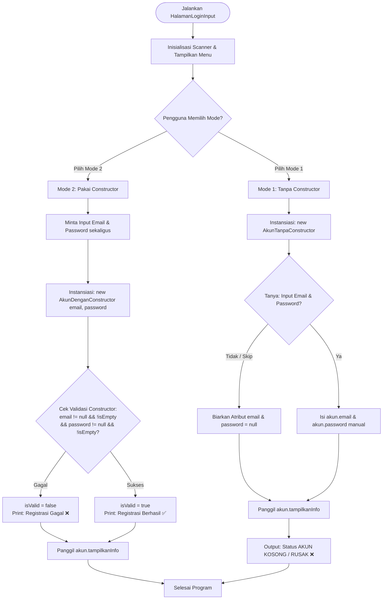

# Dokumentasi Detail Studi Kasus: Registrasi Akun Baru (PBO Java)

---

## 📌 1. Pendahuluan & Konsep Dasar Pemrograman Berorientasi Objek (PBO)

Dalam Pemrograman Berorientasi Objek (*Object-Oriented Programming* / OOP), **Constructor** adalah method khusus yang dipanggil pertama kali ketika sebuah objek diinstansiasi di memori (*Heap Memory*) menggunakan kata kunci `new`.

### Permasalahan Nyata: *State Integrity* & Objek Prematur
Tanpa constructor berparameter, sebuah objek dapat diinstansiasi terlebih dahulu sebelum atribut-atribut dasarnya diisi. Hal ini menyebabkan **Integritas Keadaan Objek (*State Integrity*)** menjadi terganggu:
* Objek `Akun` sudah tercipta di memori, tetapi nilai `email` dan `password`-nya bernilai `null`.
* Jika objek ini dikirimkan ke modul database atau autentikasi, akan memicu kesalahan fatal seperti **`NullPointerException`** atau pendaftaran akun ilegal/rusak tanpa kredensial.

**Solusi dengan Constructor Berparameter:**
Constructor berparameter bertindak sebagai **pintu gerbang (*guard gate*)**. Objek tidak akan pernah diizinkan tercipta dengan keadaan sah kecuali pengirim (*caller*) menyerahkan data `email` dan `password` secara simultan dan lolos validasi.

---

## 📁 2. Struktur Project & Peran File

```text
src/StudiKasusConstructor/
├── BuatAkun.java           # Definisi Class Model (AkunTanpaConstructor & AkunDenganConstructor)
├── HalamanLogin.java        # Main Class simulasi input pengguna berurutan
├── HalamanLoginInput.java   # Main Class simulasi interaktif berbasis menu Pilihan 1 & 2
└── penjelasan.md          # Dokumentasi teknis alur dan arsitektur program
```

---

## 💻 3. Source Code Lengkap Project

Berikut adalah kode sumber (*source code*) lengkap dari seluruh file yang ada di dalam package `StudiKasusConstructor`:

### A. Source Code [BuatAkun.java](file:///e:/Mimin%20Adresteia/pertemuan-4/src/StudiKasusConstructor/BuatAkun.java)

```java
package StudiKasusConstructor;

/**
 * STUDI KASUS: REGISTRASI AKUN BARU
 * File ini berisi perbandingan antara pembuatan objek TANPA Constructor
 * vs PAKAI Constructor berparameter untuk memvalidasi data wajib (Email & Password).
 */

// ============================================================================
// 1. KASUS TANPA CONSTRUCTOR
// ============================================================================
/**
 * Class AkunTanpaConstructor
 * Menggunakan default constructor bawaan Java (tanpa parameter).
 * Risikonya: Akun (objek) bisa terbuat duluan di memori, tetapi nilai
 * atributnya
 * belum diisi (masih null), menyebabkan akun bernilai kosong / rusak.
 */
class AkunTanpaConstructor {
    // Atribut akun
    String email;
    String password;

    /**
     * Method untuk menampilkan informasi akun.
     * Akan mendeteksi jika data email/password masih null (belum diisi).
     */
    public void tampilkanInfo() {
        System.out.println("Email    : " + email);
        System.out.println("Password : " + password);

        // Pengecekan apakah data masih bernilai null
        if (email == null || password == null) {
            System.out.println("Status   : ❌ AKUN KOSONG / RUSAK (Terbuat tanpa data lengkap!)");
        } else {
            System.out.println("Status   : ✅ Akun Aktif");
        }
    }
}

// ============================================================================
// 2. KASUS PAKAI CONSTRUCTOR
// ============================================================================
/**
 * Class AkunDenganConstructor
 * Menggunakan Constructor Berparameter.
 * Solusinya: Saat tombol "Daftar" / instansiasi dipanggil (new Akun(...)),
 * sistem WAJIB meminta Email dan Password sekaligus, serta memvalidasi data
 * tersebut.
 */
class AkunDenganConstructor {
    // Atribut akun
    String email;
    String password;
    boolean isValid; // Penanda status keabsahan pembuatan akun

    /**
     * Constructor Parameter: Memaksa pengirim mendefinisikan email & password saat
     * objek dibuat.
     * 
     * @param email    Email calon pengguna
     * @param password Password calon pengguna
     */
    public AkunDenganConstructor(String email, String password) {
        // Validasi: Email dan Password tidak boleh null maupun berupa string kosong ("")
        if (email == null || email.trim().isEmpty() || password == null || password.trim().isEmpty()) {
            System.out.println("❌ Registrasi Gagal! Email dan Password WAJIB diisi sekaligus.");
            this.isValid = false; // Akun dianggap tidak sah / gagal dibuat
        } else {
            // Jika data lengkap dan valid, set data ke atribut objek
            this.email = email;
            this.password = password;
            this.isValid = true; // Akun sah dan aktif
            System.out.println("✅ Registrasi Berhasil! Akun terdaftar secara sah.");
        }
    }

    /**
     * Method untuk menampilkan rincian informasi akun yang telah dibuat.
     */
    public void tampilkanInfo() {
        // Jika registrasi awal gagal, informasi akun tidak akan ditampilkan
        if (!isValid) {
            System.out.println("Status   : ⛔ Akun Tidak Dibuat (Data tidak lengkap)");
            return;
        }

        System.out.println("Email    : " + email);
        System.out.println("Password : " + password);
        System.out.println("Status   : ✅ Akun Aktif & Valid");
    }
}

/**
 * Class BuatAkun
 * Sebagai class pembungkus file Java di package StudiKasusConstructor.
 */
public class BuatAkun {
    // Class utama penampung model data registrasi akun
}
```

---

### B. Source Code [HalamanLogin.java](file:///e:/Mimin%20Adresteia/pertemuan-4/src/StudiKasusConstructor/HalamanLogin.java)

```java
package StudiKasusConstructor;

import java.util.Scanner;

/**
 * Class HalamanLogin
 * Menerima inputan langsung dari pengguna untuk memunculkan simulasi
 * registrasi akun tanpa constructor maupun pakai constructor.
 */
public class HalamanLogin {
    public static void main(String[] args) {
        Scanner scanner = new Scanner(System.in);

        System.out.println("=================================================");
        System.out.println("   STUDI KASUS: REGISTRASI AKUN BARU (INPUT)");
        System.out.println("=================================================\n");

        System.out.println("--- 1. INPUT UNTUK REGISTRASI PAKAI CONSTRUCTOR ---");
        System.out.print("Masukkan Email Anda    : ");
        String emailInput = scanner.nextLine();

        System.out.print("Masukkan Password Anda : ");
        String passwordInput = scanner.nextLine();

        System.out.println("\nMemproses Registrasi dangan Constructor...");
        System.out.print("Status Sistem -> ");
        
        // Memangil Constructor berparameter dengan inputan user
        AkunDenganConstructor akunUser = new AkunDenganConstructor(emailInput, passwordInput);

        System.out.println("\nHasil Pencatatan Akun:");
        akunUser.tampilkanInfo();

        System.out.println("\n-------------------------------------------------\n");

        System.out.println("--- 2. DEMO REGISTRASI TANPA CONSTRUCTOR ---");
        System.out.println("Skenario: Klik 'Daftar', objek akun terbuat duluan di memori tanpa data...");
        
        // Objek akun terbuat tanpa data
        AkunTanpaConstructor akunRusak = new AkunTanpaConstructor();
        
        System.out.println("\nHasil Pencatatan Akun Tanpa Constructor:");
        akunRusak.tampilkanInfo();

        System.out.println("\n=================================================");
        scanner.close();
    }
}
```

---

### C. Source Code [HalamanLoginInput.java](file:///e:/Mimin%20Adresteia/pertemuan-4/src/StudiKasusConstructor/HalamanLoginInput.java)

```java
package StudiKasusConstructor; //ini adalah package

import java.util.Scanner;// ini adalah scanner untuk menginputkan sesuatu

/**
 * Class HalamanLoginInput
 * Menyediakan antarmuka interaktif berbasis terminal menggunakan Scanner
 * untuk menguji registrasi akun secara langsung dari inputan pengguna.
 */
public class HalamanLoginInput {
    public static void main(String[] args) {
        Scanner scanner = new Scanner(System.in);

        System.out.println("=================================================");
        System.out.println("     FORM REGISTRASI AKUN BARU (INTERAKTIF)");
        System.out.println("=================================================\n");

        System.out.println("Pilih Mode Simulasi:");
        System.out.println("1. Registrasi TANPA Constructor (Objek dibuat duluan, data diisi belakangan)");
        System.out.println("2. Registrasi PAKAI Constructor (Wajib input Email & Password sekaligus)");
        System.out.print("PILIHAN ANDA (1/2): ");

        String pilihan = scanner.nextLine().trim(); //fungsi trim 

        System.out.println("\n-------------------------------------------------");

        if (pilihan.equals("1")) {
            System.out.println("\n[MODE 1: TANPA CONSTRUCTOR]");
            System.out.println("1. Membuat objek akun terlebih dahulu...");
            
            // Objek terbuat tanpa passing data
            AkunTanpaConstructor akun = new AkunTanpaConstructor();
            System.out.println(" Status objek awal -> Akun sudah tercipta di memori.");

            System.out.print("\nApakah Anda ingin menginputkan Email & Password? (y/n): ");
            String jawab = scanner.nextLine().trim();

            if (jawab.equalsIgnoreCase("y")) {
                System.out.print("Input Email    : ");
                akun.email = scanner.nextLine();
                
                System.out.print("Input Password : ");
                akun.password = scanner.nextLine();
            } else {
                System.out.println("⚠️ Pengisian data dilewati. Email dan Password tetap kosong!");
            }

            System.out.println("\n--- HASIL AKHIR AKUN ---");
            akun.tampilkanInfo();

        } else if (pilihan.equals("2")) {
            System.out.println("\n[MODE 2: PAKAI CONSTRUCTOR]");
            System.out.println("Silakan masukkan data pendaftaran:");

            System.out.print("Input Email    : ");
            String emailInput = scanner.nextLine();

            System.out.print("Input Password : ");
            String passwordInput = scanner.nextLine();

            System.out.println("\nMemproses instansiasi objek dengan Constructor...");
            System.out.print("Proses -> ");
            
            // Memanggil Constructor berparameter dengan inputan user
            AkunDenganConstructor akun = new AkunDenganConstructor(emailInput, passwordInput);

            System.out.println("\n--- HASIL AKHIR AKUN ---");
            akun.tampilkanInfo();

        } else {
            System.out.println("❌ Pilihan tidak valid. Silakan jalankan ulang program.");
        }

        System.out.println("\n=================================================");
        scanner.close();
    }
}
```

---

## 🔬 4. Bedah Kode Detail (Line-by-Line Code Breakdown)

### A. Class `AkunTanpaConstructor` (Pendekatan Rentan/Insecure)
* **Baris 19-22**: Mengabaikan penulisan constructor. Akibatnya, Java secara otomatis menyertakan *Default Constructor* tanpa parameter (`public AkunTanpaConstructor() {}`). Atribut `email` dan `password` diberi nilai bawaan `null`.
* **Baris 28-38**: Method `tampilkanInfo()` mendeteksi jika salah satu atau kedua atribut bernilai `null`, yang menandakan bahwa objek akun terbuat secara prematur sebelum pengisian data.

### B. Class `AkunDenganConstructor` (Pendekatan Aman/Secure)
* **Baris 55**: `isValid` berfungsi sebagai flag penanda status. Jika registrasi gagal, flag ini bernilai `false`.
* **Baris 64-77**: **Constructor Berparameter**. 
  * `email == null || email.trim().isEmpty()` mengecek apakah email `null` atau hanya berisi spasi kosong (`"   "`).
  * Kata kunci `this.email = email;` memindahkan nilai parameter lokal `email` ke dalam atribut objek `this.email`.
* **Baris 82-92**: `tampilkanInfo()` memiliki *Guard Clause* (`if (!isValid) return;`) sehingga jika registrasi awal ditolak, informasi kredensial palsu/kosong tidak akan dicetak.

---

## 🧠 5. Analisis Memori: Heap vs Stack Management

Saat program Java dijalankan, alokasi memori dibagi menjadi **Stack** dan **Heap**:

```text
[ STACK MEMORY ]                          [ HEAP MEMORY ]
+------------------------------+          +-----------------------------------+
| HalamanLoginInput.main()     |          | Object: AkunTanpaConstructor      |
|                              |          | --------------------------------- |
| akun (reference address) --->|--------->| email    = null                   |
|                              |          | password = null                   |
+------------------------------+          +-----------------------------------+
                                            ⚠️ Objek bocor di Heap dengan null!

+------------------------------+          +-----------------------------------+
| AkunDenganConstructor        |          | Object: AkunDenganConstructor     |
|                              |          | --------------------------------- |
| emailInput = "mimin@g..."    |          | email    = "mimin@gmail.com"      |
| passwordInput = "12345"      |          | password = "12345"                |
| akun (reference) --------->|--------->| isValid  = true                   |
+------------------------------+          +-----------------------------------+
                                            ✅ Objek diisi & divalidasi presisi!
```

1. **Pada `AkunTanpaConstructor`**:
   Variabel referensi `akun` disimpan di **Stack**, merujuk pada Objek `AkunTanpaConstructor` di **Heap**. Namun nilai di dalam Heap masih `null` karena pengisian atribut dilakukan secara terpisah di baris berikutnya.
2. **Pada `AkunDenganConstructor`**:
   Saat `new` dieksekusi, nilai dari Stack (`emailInput`, `passwordInput`) langsung dioper ke constructor, divalidasi, dan ditulis ke Heap **sebelum** referensi objek dikembalikan.

---

## 🔄 6. Diagram Alur Program (Flowchart Executable)



---

## ⚖️ 7. Matriks Perbandingan Teknis Detail

| Parameter Evaluasi | Tanpa Constructor | Pakai Constructor Berparameter |
| :--- | :--- | :--- |
| **Sintaks Instansiasi** | `new AkunTanpaConstructor()` | `new AkunDenganConstructor(email, password)` |
| **Waktu Pengisian Data** | Setelah objek dibuat (Terpisah) | Saat objek dibuat (Atas/Simultan) |
| **Peluang `NullPointerException`** | Sangat Tinggi | Hampir Nol (Dibatalkan di awal) |
| **Kontrol Akses Validasi** | Tersebar di luar kelas | Terpusat di dalam Constructor kelas |
| **Keamanan Data (Data Security)** | Rendah (Bisa bocor objek kosong) | Tinggi (Enkapsulasi terjamin) |
| **Reusability / Kebersihan Kode** | Banyak pengulangan assignment | Ringkas, 1 baris instansiasi + validasi |

---

## 📚 8. Istilah & Keyword Penting Java PBO

1. **`java.util.Scanner`**: Kelas utility Java untuk membaca aliran teks input terminal.
2. **`trim()`**: Method string untuk menghapus karakter spasi di awal & akhir string (`"  admin  "` $\rightarrow$ `"admin"`).
3. **`isEmpty()`**: Method string untuk memeriksa apakah panjang karakter adalah 0 (`""`).
4. **`this` Keyword**: Referensi ke objek saat ini untuk menghindari *variable shadowing* antara atribut kelas dan parameter method.
5. **Flag `isValid`**: Variabel boolean penanda (*state flag*) untuk mengontrol eksekusi method selanjutnya.
6. **Guard Clause**: Pola penulisan kode di awal method yang langsung melakukan `return` jika syarat kondisi tidak terpenuhi.

---

## 🧪 9. Kasus Uji & Contoh Eksekusi

### Kasus Uji 1: Pendaftaran Berhasil (Data Lengkap)
* **Input**: Email = `mimin@gmail.com`, Password = `Password123`
* **Hasil**:
  ```text
  Proses -> ✅ Registrasi Berhasil! Akun terdaftar secara sah.
  Email    : mimin@gmail.com
  Password : Password123
  Status   : ✅ Akun Aktif & Valid
  ```

### Kasus Uji 2: Pendaftaran Gagal (Password Kosong/Spasi)
* **Input**: Email = `mimin@gmail.com`, Password = `   `
* **Hasil**:
  ```text
  Proses -> ❌ Registrasi Gagal! Email dan Password WAJIB diisi sekaligus.
  Status   : ⛔ Akun Tidak Dibuat (Data tidak lengkap)
  ```

### Kasus Uji 3: Tanpa Constructor (Pengisian Dilewati)
* **Input**: Memilih Mode 1 dan menolak menginputkan data (`n`)
* **Hasil**:
  ```text
  Status objek awal -> Akun sudah tercipta di memori.
  ⚠️ Pengisian data dilewati. Email dan Password tetap kosong!
  Email    : null
  Password : null
  Status   : ❌ AKUN KOSONG / RUSAK (Terbuat tanpa data lengkap!)
  ```
